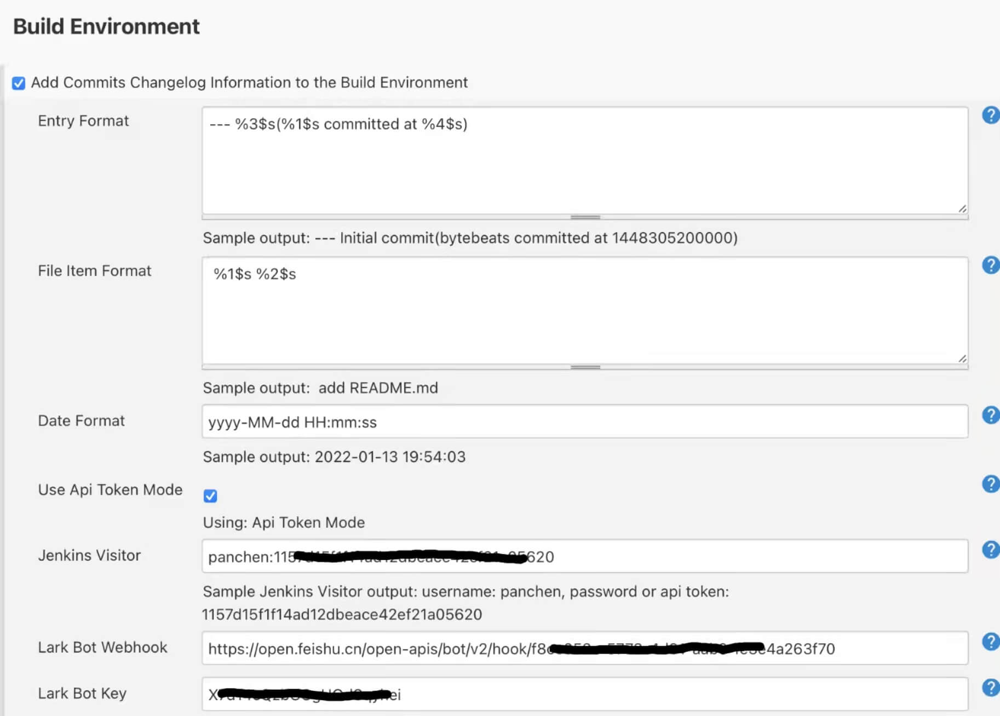
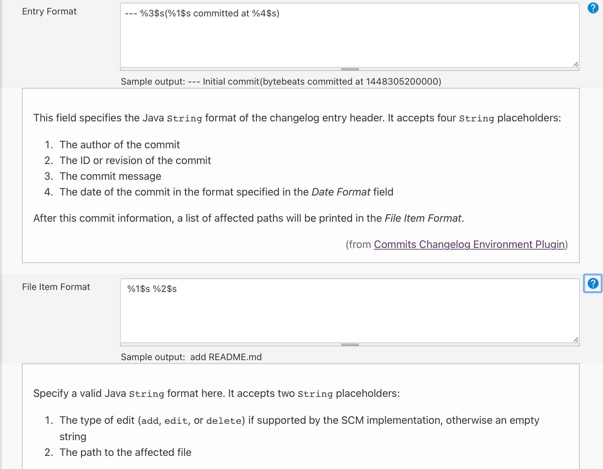
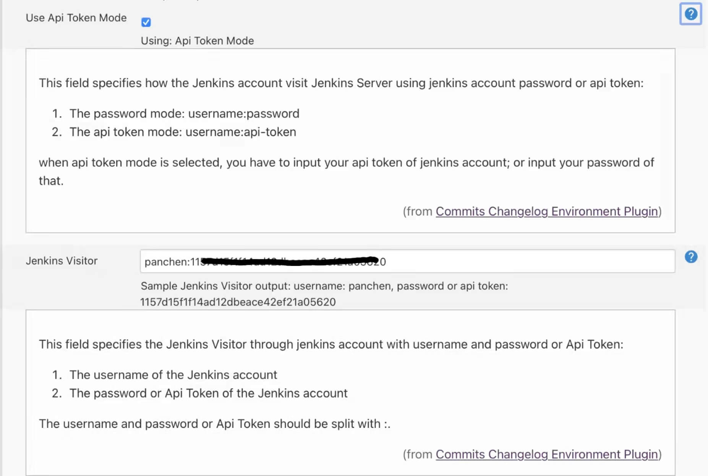
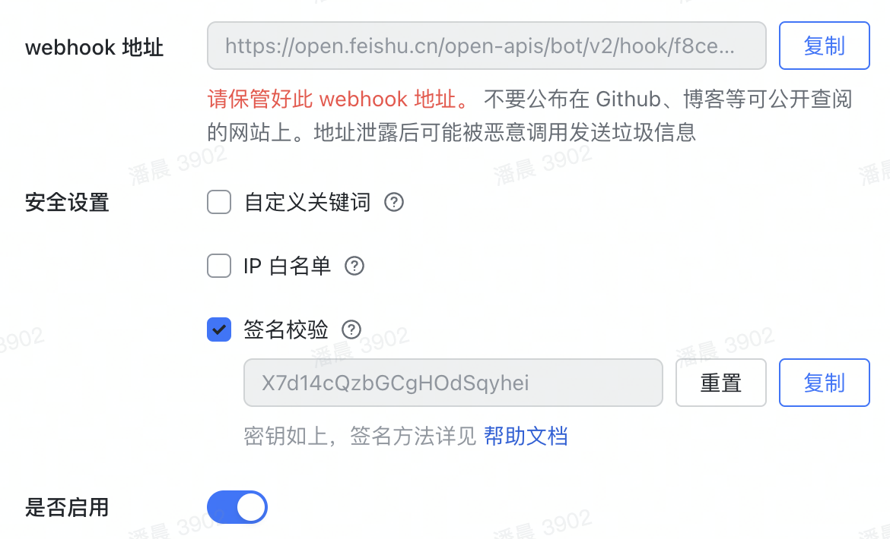

# commits-changelog-env-plugin

[README](README.md)

Jenkins插件, 在构建时通过将提交的更新列表插入 Jenkins 构建环境, 从而实现将提交信息通知给飞书/钉钉机器人.

## 插件在哪? 如何开启?

jenkins分支 > Configure -> Build Environment -> Add Commits Changelog Information to the Build Environment,
可以通过勾选框进行启用或者禁用.

## 如何将插入的 commit 信息推送给飞书机器人?

读取构建环境内容并向飞书机器人推送信息的脚本文件为 `lark_dev_changelog_bot.py` 可以在构建时执行该文件.

jenkins分支 > Configure -> Build -> Execute Windows batch command 的输入框中, 插入指令 `python lark_dev_changelog_bot.py`, 由此构建时便会自动执行该指令.

## 插件有哪些属性? 分别表示什么意思?

* **Entry Format**, 表示插件到构建环境中的 commit 格式. 如 `--- %3$s(%1$s committed at %4$s)` 则表示的 commit
  信息为 `--- Initial commit(bytebeats committed at 1448305200000)`. 数字及其表示的含义如下:
    1. commit的作者
    2. commit 或者 revision 的 ID
    3. commit 的描述信息
    4. 以 Date Format 指定的格式显示的 commit 日期 推荐使用如上例格式. 因为 [文件]{/lark_commits_changelog_bot.py}使用该格式解析日期.
* **File Item Format**, 一次 commit 中受影响文件的格式. 如` %1$s %2$s` 展示成 ` add README.md`. 数字及其表示的含义如下:
    1. 文体发生变动的类型, 如 `add`, `edit`, `delete`分别表示 `增加`, `修改`, `删除`.
    2. 受影响文件的地址. 如 `/a/b/c/README.md`. 推荐使用如上例格式.
* **Date Format**, 日期格式, Java 标准日期格式, 如 `yyyy-MM-dd HH:mm:ss`, 该值直接影响 Entry Format 中 4 的展示格式
* **Use Api Token Mode**, 是否使用 Api Token模式. 访问 Jenkins 服务器时, 有 2 种访问模式:
    1. Api Token 模式, 输入框中输入 `username:token`
    2. password 模式, 输入框中输入 `username:password`
       因为我司要求定期修改密码, 因此, 为长期使用, 推荐选择 Api Token 模式.
* **Affected Files Included**, Jenkins构建环境中是否包含受影响文件. 推荐不包含, 即不勾选, 因为可能一次 commit 当中包含了很多条文件信息, 展示出来内容过长, 且样式不好看.
* **Max Displayed Changes**, Jenkins 构建环境中最多插入多少条 commit 信息. 若不输入此值, 默认最多插入 30 条. 因为一次构建中可以提交了成百上千条 commit, 可能真的没必要全部展示展示出来.
* **Jenkins Visitor**, Jenkins 访问者, 以 `username:token` 或者 `username:password` 形式输入, 中间以 `:`(注意是英文符号) 分隔开. 具体选用哪种方式, 同 Use
  Api Token Mode
* **Lark Bot Webhook**, 飞书机器人的 Webhook. 此为必须项, 具体请查看 飞书 -> 群机器人 -> webhook 选项.
* **Lark Bot Key**, 飞书机器人的密钥, 此为非必须项, 如果 飞书 -> 群机器人 -> 安全设置 -> 签名校验 开启, 则必须填写签名校验的密钥.

## 插件配置的最佳实践是什么?

* **Entry Format**, 输入`--- %3$s(%1$s committed at %4$s)`
* **File Item Format**, 输入` %1$s %2$s` 展示成 ` add README.md`
* **Date Format**, 输入`yyyy-MM-dd HH:mm:ss`
* **Use Api Token Mode**, 勾选使用 Api Token 模式
* **Affected Files Included**, 不勾选, 不将 commit影响文件插入构建环境
* **Max Displayed Changes**, 默认30, 嫌多可以适当减小些, 嫌少可以适当增大些.
* **Jenkins Visitor**, 推荐以 `username:token` 形式输入, 中间以 `:`(注意是英文符号) 分隔开
* **Lark Bot Webhook**, 飞书机器人的 Webhook. 此为必须项.
* **Lark Bot Key**, 飞书机器人的密钥, 此为非必须项, 如果 飞书 -> 群机器人 -> 安全设置 -> 签名校验 开启, 则必须填写签名校验的密钥.

## Visual Effect

